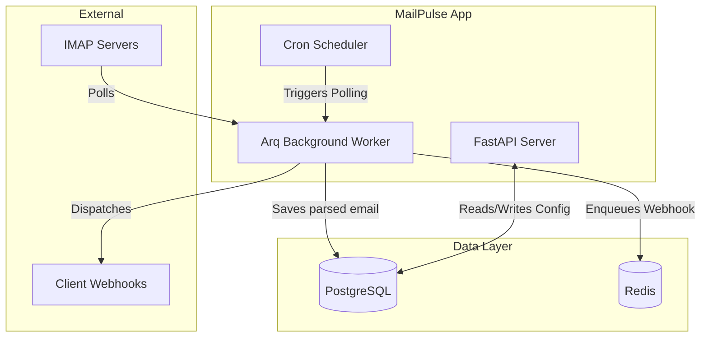

# Architecture

MailPulse utilizes a modern, asynchronous architecture designed for high throughput and reliability.

## System Diagram

## Service Layer Pattern
The application follows a clean architecture pattern with distinct layers:
1. **API Routers (`app/api/`)**: Handle HTTP requests and response formatting.
2. **Services (`app/services/`)**: Contain the core business logic (e.g., `WebhookService`, `EmailProcessingService`).
3. **Repositories (`app/database/repositories/`)**: Abstract database operations and queries.

## Event-Driven Design
By utilizing Redis and the `arq` library, MailPulse decouples email ingestion from webhook delivery. This ensures that a slow or failing client webhook does not block the ingestion of new emails.
