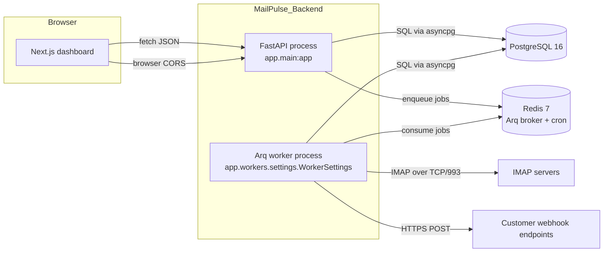

# Architecture

MailPulse is a small, layered system built around three runtime processes
(FastAPI API, Arq worker, Next.js dashboard) sharing one Postgres database
and one Redis instance.

This page explains:

- What each process is responsible for (and what it explicitly does **not**
  do)
- How data flows from an IMAP server to a customer's webhook endpoint
- How the codebase is organised internally

## Components



### FastAPI process (`app/main.py`)

Responsibilities:

- HTTP routing for all authenticated endpoints under `/api/v1/`
- JWT verification and user identity resolution
- Validation of every request/response via Pydantic schemas
- Read/write to Postgres through SQLAlchemy repositories
- Optional enqueueing of jobs into Redis (e.g. `enqueue_monitor_sweep` for
  manual triggers)
- Deep health checks against Postgres and Redis at `/health/system`

Explicitly does **not**:

- Connect to IMAP servers
- Send outbound HTTP (no webhook delivery from the API process)
- Run cron tasks

### Arq worker process (`app/workers/`)

Responsibilities:

- Run the cron-scheduled jobs (`monitor_mailboxes`,
  `retry_failed_webhook_deliveries`)
- Consume jobs from Redis and execute them
- Open IMAP connections to fetch new mail
- Parse MIME into `EmailEvent` rows
- Sign and POST webhook payloads
- Record every delivery attempt in `webhook_deliveries`

Explicitly does **not**:

- Accept inbound HTTP requests
- Validate user input beyond what the job parameters require

### Next.js dashboard (`frontend/`)

- Renders the management UI
- Calls the API via TanStack Query, sending the access token in
  `Authorization: Bearer …`
- Refreshes the access token transparently when it expires (single-flight
  refresh to coalesce parallel 401s)
- Never talks to Postgres or Redis directly — the API is the only entry point

### PostgreSQL

The system of record. All persistent state lives here. The schema is
managed by Alembic; see [database.md](database.md) for the table-level
breakdown.

Tables:

- `users` — accounts
- `refresh_tokens` — hashed, revocable refresh tokens
- `mailboxes` — IMAP credentials (encrypted), polling state
- `email_events` — parsed emails
- `webhooks` — destinations with encrypted signing secrets
- `webhook_deliveries` — per-attempt delivery log

### Redis

Single purpose: the Arq job broker and cron store. Keys include:

- Arq's job queue (`arq:queue`)
- Arq's cron registry (`arq:cron`)
- Per-job deduplication IDs (e.g. `arq:job:process-email:<mailbox>:<uid>`)
- In-flight job results (TTL bounded by `ARQ_JOB_TIMEOUT`)

Redis is not used for application caching today.

## Layered backend design

```text
HTTP request
   │
   ▼
app/api/v1/<resource>/routes.py    ← FastAPI router, dependency injection,
   │                                  request/response Pydantic schemas
   ▼
app/services/<area>/<service>.py   ← Business logic. Knows about repos and
   │                                  other services. No HTTP types here.
   ▼
app/database/repositories/*.py     ← SQLAlchemy queries. One repository per
   │                                  aggregate root.
   ▼
app/database/models/*.py           ← ORM models. Schema is the source of truth
                                      (Alembic reads Base.metadata).
```

Each layer only knows about the layer directly below it. Routers never touch
SQLAlchemy directly; services never touch HTTP; repositories never touch
Pydantic schemas.

## Request flow: registering and using a webhook

```mermaid
sequenceDiagram
    autonumber
    participant U as User
    participant B as Browser (Next.js)
    participant A as FastAPI
    participant DB as PostgreSQL
    participant R as Redis
    participant IMAP as IMAP server
    participant W as Arq worker
    participant H as Customer webhook

    U->>B: open /webhooks, click "Add"
    B->>A: POST /api/v1/auth/refresh (auto)
    A-->>B: new token pair
    B->>A: POST /api/v1/webhooks (Bearer access)
    A->>A: decode JWT → user_id
    A->>DB: INSERT webhooks (encrypted_secret, prefix, event_types)
    A-->>B: 201 WebhookCreatedResponse(secret=whsec_…)
    Note over B: secret is shown once in UI;<br/>browser prompts user to save it

    Note over W: cron fires
    W->>R: dequeue monitor_mailboxes
    W->>IMAP: SEARCH UNSEEN
    IMAP-->>W: list of UIDs
    W->>R: enqueue process_email_message (per UID)
    W->>R: dequeue process_email_message
    W->>IMAP: UID FETCH RFC822
    W->>W: parse → EmailEvent
    W->>DB: INSERT email_events
    W->>IMAP: STORE \Seen
    W->>R: enqueue dispatch_webhook(event_id)
    W->>R: dequeue dispatch_webhook
    W->>DB: load webhooks WHERE user_id=… AND is_enabled
    W->>R: enqueue deliver_webhook(delivery_id)
    W->>R: dequeue deliver_webhook
    W->>DB: load event + webhook
    W->>W: HMAC-SHA256 sign
    W->>H: POST JSON + signature headers
    H-->>W: 200 OK
    W->>DB: UPDATE webhook_deliveries status='delivered'
```

## Concurrency model

- **Within the API**: a single Uvicorn worker handles many concurrent
  requests via `asyncio`. SQLAlchemy sessions are request-scoped via the
  `get_db_session` dependency. Blocking calls (none in the request path
  today, but conceivable in custom code) must use `run_in_threadpool`.
- **Within the worker**: Arq runs each function in its own asyncio task.
  The default job concurrency is configurable per Arq settings; the worker
  opens a fresh IMAP connection per mailbox per sweep to avoid sharing
  state across coroutines.
- **Across processes**: the API and worker never share in-process state.
  Coordination is exclusively through Postgres (read/write to durable
  tables) and Redis (job queue).

## Failure isolation

| Failure                         | Effect on other components                                                  |
| ------------------------------- | --------------------------------------------------------------------------- |
| IMAP server unreachable         | Mailbox `health_status` becomes `error`; other mailboxes continue.           |
| Webhook endpoint returns 5xx    | Delivery retried per backoff schedule; API and parsing are unaffected.      |
| Webhook endpoint is slow (10s+) | Delivery worker holds the job until timeout; other jobs continue.            |
| API process crashes             | Worker continues to poll and deliver; dashboard shows 502 until restart.     |
| Worker process crashes          | API continues to serve CRUD; new mail stops being parsed until worker restarts. Pending jobs remain in Redis. |
| Redis goes down                 | API can serve read paths but job enqueue fails; worker cannot consume.       |
| Postgres goes down              | API returns 5xx; worker cannot persist events or deliveries.                 |

## Where to look in the code

| You want to change…        | Start here                                                |
| -------------------------- | --------------------------------------------------------- |
| An API endpoint shape      | `app/api/v1/<area>/routes.py` and `app/schemas/<area>.py` |
| Validation rules           | `app/schemas/<area>.py`                                   |
| Business logic             | `app/services/<area>/<service>.py`                        |
| A database query           | `app/database/repositories/<repo>.py`                     |
| The DB schema              | `alembic/versions/` (new migration) + `app/database/models/` |
| A background job           | `app/workers/tasks.py` (function) + `app/workers/settings.py` (registration) |
| Cron timing                | `app/workers/settings.py` (`_build_cron_jobs`)            |
| Retry policy               | `app/core/config/settings.py` (`webhook_retry_delays_seconds`) |
| Logging                    | `app/core/logging/setup.py`                               |
| Dashboard route            | `frontend/app/(protected)/<area>/page.tsx`                |
| Dashboard API call         | `frontend/services/` + `frontend/features/<area>/`        |
