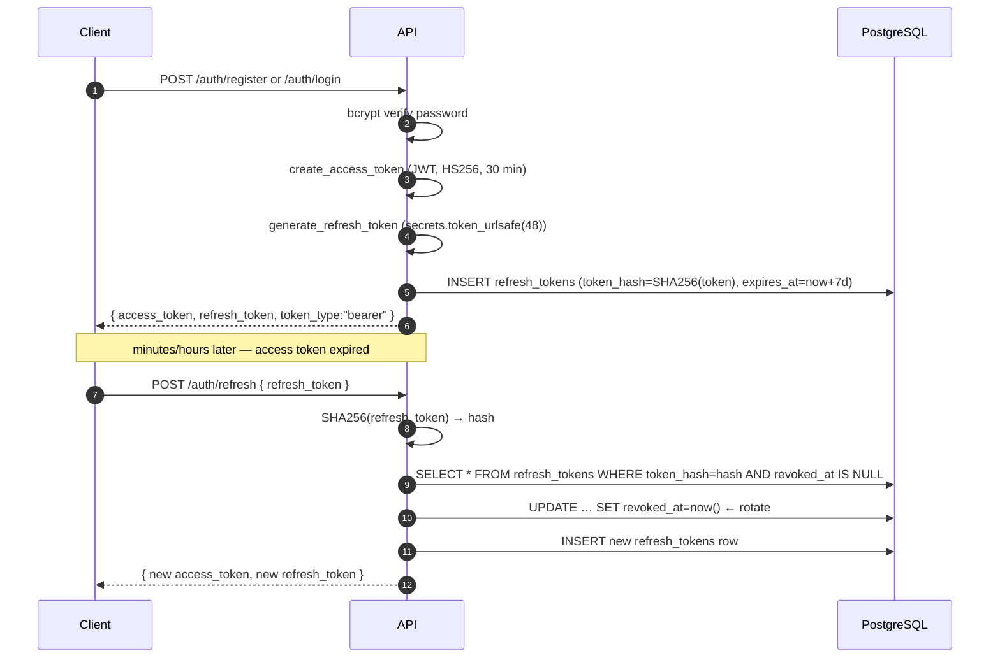

# Authentication

MailPulse issues two token types after login:

- **Access token** — short-lived JWT used for every authenticated API call.
- **Refresh token** — opaque, long-lived, single-use credential used to mint
  new access tokens.

This page explains the mechanics so you can integrate confidently and debug
auth failures.

## Overview



## Access token (JWT)

Defined in `app/core/security/jwt.py`.

- **Algorithm:** HS256 (default; configurable via `JWT_ALGORITHM`).
- **Secret:** `JWT_SECRET_KEY` from settings. **Must be replaced in any
  non-development environment.**
- **Lifetime:** `ACCESS_TOKEN_EXPIRE_MINUTES` (default `30`).
- **Claims:**
  - `sub` — user UUID (string)
  - `exp` — expiry (Unix timestamp)
  - `type` — fixed to `"access"` (rejects anything else at decode time)

The token is verified in `app/api/deps.py::get_current_user`:

```python
payload = decode_access_token(credentials.credentials)
user_id = UUID(payload["sub"])
user = await user_repo.get_by_id(user_id)
if user is None or not user.is_active:
    raise AuthenticationError("User not found or inactive")
```

There is **no JWT blocklist**. Logging out does not invalidate the access
token; it expires naturally. If you need immediate revocation, lower
`ACCESS_TOKEN_EXPIRE_MINUTES` or layer a Redis-backed blocklist on top.

## Refresh token

Stored in `app/database/models/user.py::RefreshToken`.

| Column        | Notes                                                                   |
| ------------- | ----------------------------------------------------------------------- |
| `id`          | UUID PK.                                                                |
| `user_id`     | FK to `users.id`, `ON DELETE CASCADE`.                                  |
| `token_hash`  | SHA-256 hex of the raw token. The raw token is never stored.            |
| `expires_at`  | `now() + REFRESH_TOKEN_EXPIRE_DAYS` (default `7`).                      |
| `revoked_at`  | Set on rotation, logout, or explicit revoke. Nullable.                  |
| `created_at`  | Server timestamp.                                                       |

Generation uses `secrets.token_urlsafe(48)` — 48 random bytes encoded as
URL-safe base64 (~64 characters).

### Rotation

Every successful refresh:

1. Marks the presented refresh token's `revoked_at` to `now()`.
2. Generates a fresh token and inserts a new row.

This means replaying an old refresh token returns `401 Unauthorized` (the
hash lookup finds the row but `revoked_at` is set). The client should
treat any such response as a forced logout.

### Password hashing

`app/core/security/jwt.py::hash_password` uses passlib's bcrypt context:

```python
pwd_context = CryptContext(schemes=["bcrypt"], deprecated="auto")
```

- Plain passwords never leave the request handler.
- `verify_password` re-hashes and compares with constant-time equality.
- Passlib emits `DeprecationWarning` on bcrypt >= 4.x; this is suppressed in
  `pytest.ini` because bcrypt >= 4 is intentional.

## CREDENTIAL_ENCRYPTION_KEY

This is **not** used for auth tokens — it is the symmetric key for encrypting
secrets stored at rest:

- `Mailbox.encrypted_password` — IMAP password
- `Webhook.encrypted_secret` — webhook signing secret

Defined in `app/core/security/encryption.py`:

```python
def _build_fernet() -> Fernet:
    settings = get_settings()
    source = settings.credential_encryption_key or settings.jwt_secret_key
    digest = hashlib.sha256(source.encode()).digest()
    key = base64.urlsafe_b64encode(digest)
    return Fernet(key)
```

- The key is SHA-256 of `CREDENTIAL_ENCRYPTION_KEY`, then base64-url-safe
  encoded to satisfy Fernet's key shape.
- **If `CREDENTIAL_ENCRYPTION_KEY` is empty, the encryption layer falls
  back to `JWT_SECRET_KEY`.** The system still works, but losing
  `JWT_SECRET_KEY` then becomes doubly destructive — both auth tokens and
  every encrypted secret become unrecoverable. Always set a distinct
  value in production.
- **Losing the effective key permanently bricks every encrypted row.**
  Back it up.
- For development, `scripts/generate-env.sh` creates a random value; for
  production, generate it once and pin it across all instances.

## Password requirements

`UserRegisterRequest.password` enforces:

- `min_length=8`, `max_length=128`

Email is validated via `email-validator` (`EmailStr`).

Email verification, account recovery, OAuth/social login, and rate limiting
are **not implemented** today (see the project roadmap in the README).

## Webhook payload signing

Webhook payloads are signed with an **independent** secret per webhook. See
[webhooks.md](webhooks.md#signature-verification) for the algorithm and a
verifier in three languages.

## Security checklist

For any non-local deployment:

- [ ] `JWT_SECRET_KEY` is a long random string, not the default.
- [ ] `CREDENTIAL_ENCRYPTION_KEY` is a long random string, distinct from
      `JWT_SECRET_KEY`.
- [ ] `ACCESS_TOKEN_EXPIRE_MINUTES` is short enough for your risk profile.
- [ ] Postgres is not exposed on the public internet (only the API is).
- [ ] Redis is not exposed on the public internet.
- [ ] The dashboard is served over TLS (terminate at your reverse proxy).
- [ ] `CORS_ORIGINS` lists only the origins you actually serve.
