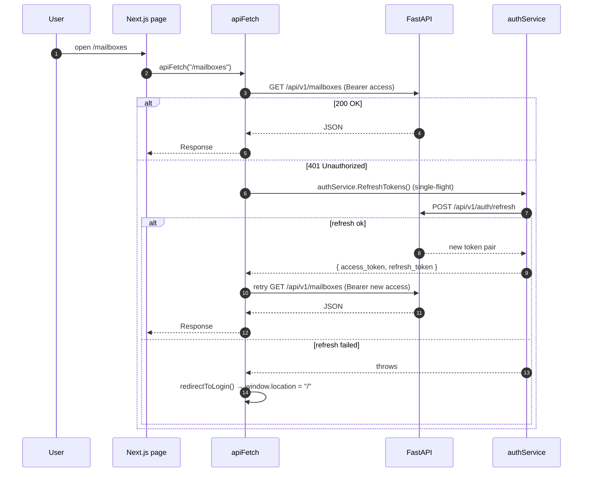

# Dashboard

The MailPulse dashboard is a Next.js 16 application in `frontend/`. It uses
the App Router, React Server Components, and a small set of client-side
features for interactivity.

## Stack

- Next.js `16.2.12` with `output: "standalone"` for a thin production
  image.
- React `19.2.4`.
- Tailwind v4 (`@tailwindcss/postcss`) with shadcn/ui primitives.
- TanStack Query v5 for data fetching and cache management.
- Zustand for tiny client stores.
- Recharts for the analytics charts.
- Lucide for icons.

## Directory layout

```text
frontend/
├── app/
│   ├── layout.tsx               # Root layout: fonts, ThemeProvider, QueryProvider, Toaster
│   ├── page.tsx                 # Public landing → AuthContainer (login / register)
│   ├── globals.css              # Tailwind layers + CSS variables
│   └── (protected)/
│       ├── layout.tsx           # AuthGuard + SidebarProvider + AppSidebar
│       ├── dashboard/page.tsx
│       ├── mailboxes/page.tsx
│       ├── webhooks/page.tsx
│       ├── events/page.tsx
│       ├── analytics/page.tsx
│       └── system/page.tsx
├── components/
│   ├── AppSidebar.tsx           # shadcn sidebar shell
│   ├── MainContainer.tsx
│   ├── QueryProvider.tsx        # TanStack Query client + devtools
│   ├── ThemeProvider.tsx        # next-themes
│   ├── DarkModeSwitcher.tsx
│   └── ui/                      # shadcn primitives (button, card, input, sheet, …)
├── config/
│   └── config.ts                # Resolves NEXT_PUBLIC_* env vars
├── features/
│   ├── auth/                    # AuthContainer, LoginContainer, SignupContainer, AuthGuard
│   ├── dashboard/               # DashboardPage, header, stats, tables, volume chart
│   ├── mailboxes/               # MailboxesPage
│   ├── webhooks/                # WebhooksPage
│   ├── events/                  # EventsPage
│   ├── analytics/               # AnalyticsPage
│   ├── infrastructure/          # Shared infrastructure components
│   └── system/                  # SystemPage (health, queues)
├── services/
│   ├── api-client.ts            # fetch wrapper with auto-refresh + 401 → login
│   ├── auth.ts                  # login / register / refresh / logout
│   ├── health.ts                # /health/system wrapper
│   └── infrastructure.ts
├── stores/
│   ├── auth.store.ts
│   └── dashboard.store.ts
├── hooks/auth/                  # useAuth, etc.
├── lib/utils.ts                 # cn() helper for Tailwind classes
├── utils/
│   ├── auth-utils.ts            # token storage helpers
│   ├── data/                    # data formatting
│   └── mockup-data/             # placeholder fixtures for layout work
├── Dockerfile                   # Three-stage Next.js production image
├── next.config.ts               # output: "standalone"
├── eslint.config.mjs            # eslint-config-next (Web Vitals + TS)
└── package.json
```

## Auth flow on the client



`frontend/services/api-client.ts` implements the single-flight refresh
(`refreshPromise` is shared across concurrent 401s) so that parallel
failing requests do not trigger N refresh calls.

Tokens are kept in `localStorage` under `accessToken` / `refreshToken`.
Logging out clears both and redirects to `/`.

## Routes

| Path                        | What it shows                                                         |
| --------------------------- | --------------------------------------------------------------------- |
| `/`                         | Auth screen — tabs for login and register.                            |
| `/(protected)/dashboard`    | Overview KPIs, email-volume chart, top tables, recent activity.       |
| `/(protected)/mailboxes`    | List of mailboxes, add/edit/delete, test IMAP connection.             |
| `/(protected)/webhooks`     | List of webhooks, add/edit/delete, rotate secret, test delivery.      |
| `/(protected)/events`       | Recent email events with payload preview.                             |
| `/(protected)/analytics`    | KPIs, top senders, per-webhook performance, daily volume.              |
| `/(protected)/system`       | System health (DB, Redis, queue) + delivery counts.                   |

## Configuration

Two environment variables drive runtime config. Both are read by
`frontend/config/config.ts`:

| Variable                          | Default                  | Purpose                                                       |
| --------------------------------- | ------------------------ | ------------------------------------------------------------- |
| `NEXT_PUBLIC_API_URL`             | `http://localhost:3000`  | Public URL of the dashboard itself (used for links/redirects).|
| `NEXT_PUBLIC_FASTAPI_BACKEND_URL` | `http://localhost:8000`  | Base URL the browser fetches `/api/v1/*` against.             |

`NEXT_PUBLIC_*` is inlined into the client bundle at build time. Changing
either value requires a rebuild (`npm run build` or a Docker rebuild).

`scripts/generate-env.sh` writes these values automatically:

- Container mode (default): `NEXT_PUBLIC_FASTAPI_BACKEND_URL=http://api:8080`
  (used during `docker compose up`).
- Host mode (`--host`): `NEXT_PUBLIC_FASTAPI_BACKEND_URL=http://localhost:8080`
  (used for `npm run dev` against a locally running API).

## Local development

```bash
cd frontend
npm install
npm run dev        # http://localhost:3000
```

The dev server proxies nothing for `/api/*`; it expects the backend to be
reachable at the configured `NEXT_PUBLIC_FASTAPI_BACKEND_URL`. Start the
backend separately:

```bash
docker compose up -d postgres redis
scripts/generate-env.sh --host
alembic upgrade head
uvicorn app.main:app --reload --port 8080
arq app.workers.settings.WorkerSettings
```

## Production build

```bash
cd frontend
npm run build
npm start          # http://localhost:3000
```

Or via Docker Compose, which builds the `dashboard` service using
`frontend/Dockerfile`:

```yaml
dashboard:
  build:
    context: ./frontend
    dockerfile: Dockerfile
    args:
      NEXT_PUBLIC_FASTAPI_BACKEND_URL: http://api:8080
```

The Dockerfile is a three-stage build (`deps → builder → runner`) that
produces a non-root Node Alpine image running `server.js` from
`.next/standalone`.

## Adding a page

1. Add `frontend/app/(protected)/<area>/page.tsx` (Server Component is fine
   for static structure).
2. Put the interactive component under `frontend/features/<area>/` as a
   Client Component (`"use client"` at the top).
3. Use `apiFetch` from `frontend/services/api-client.ts` to call the API;
   never call `fetch` directly.
4. If you need to cache data on the client, prefer TanStack Query
   (`useQuery`, `useMutation`) over local state.
5. If you add new primitives, generate them with `npx shadcn@latest add <name>`
   to match the existing theme.

## Theme

- Light + dark theme via `next-themes` (toggle in the sidebar).
- Tailwind v4 + shadcn `base-vega` style + `neutral` base color.
- Default fonts: Geist (UI), Inter (body), Urbanist (display headings),
  Geist Mono (code).

## Linting

```bash
cd frontend
npm run lint
```

ESLint 9 with `eslint-config-next/core-web-vitals` and
`eslint-config-next/typescript`. The config is in `eslint.config.mjs`.

## What is NOT in the dashboard yet

- Webhook delivery inspector (raw payload + response viewer).
- Rules engine for filtering emails before dispatch.
- Event replay UI.
- Multi-organisation support.

See the project README's roadmap for context.
