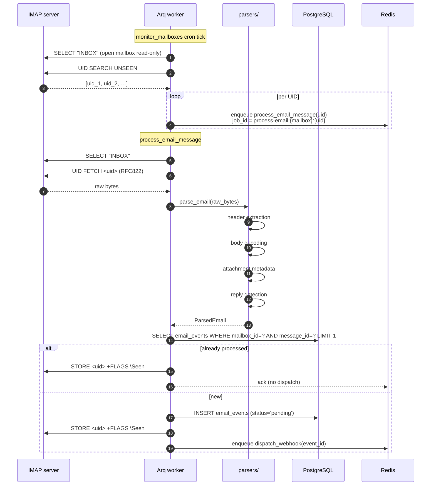

# Email Processing

This page walks through what happens between an email arriving at an IMAP
server and a structured `EmailEvent` row appearing in PostgreSQL.



## Polling

`app/services/email_processing/event_service.py::EmailProcessingService.poll_all_enabled_mailboxes`
is called by `monitor_mailboxes` (see [workers.md](workers.md)). For each
mailbox with `is_enabled=true` and `deleted_at IS NULL`, it:

1. Opens an IMAP connection via `app/services/mailbox/imap_connection.py`.
   Credentials are decrypted with Fernet on the fly.
2. Selects the `INBOX` mailbox read-only.
3. Issues `UID SEARCH UNSEEN`.
4. For each returned UID, enqueues `process_email_message(mailbox_id, uid)`
   with a deduplicating `_job_id`.

A connection error increments `last_error_at` / `last_error_message` and
sets `health_status` to `error` for that mailbox. Other mailboxes are
unaffected.

## Parsing

`app/services/email_processing/email_parser.py::EmailParser.parse_email(raw_bytes)`
returns a structured representation with these fields:

- `message_id` — RFC822 `Message-ID`.
- `from_email`, `from_name` — parsed from the `From` header.
- `to` — list of recipient strings.
- `subject` — decoded subject.
- `text_body`, `html_body` — charset-normalised text/plain and text/html.
- `in_reply_to` — RFC822 `In-Reply-To` if present.
- `attachments` — list of `{filename, content_type, size}` metadata.
- `received_at` — parsed `Date` header.

Helpers:

- `parsers/sender.py` — `From` parsing
- `parsers/subject.py` — RFC 2047 encoded-word decoding
- `parsers/body.py` — text/plain + text/html extraction, charset handling
- `parsers/reply.py` — quoted-reply detection via `email-reply-parser`
- `parsers/signatures.py` — common signature markers (best-effort stripping)
- `attachment_extractor.py` — filename + content-type + size extraction

> Attachments are **not** stored or delivered via webhook today. Only
> metadata is captured. To extend this, change
> `attachment_extractor.extract` and the `EmailEvent` model.

## Storage

`process_email_message` (`app/workers/tasks.py`) does the database work:

```python
async with worker_session() as session:
    service = EmailProcessingService(session)
    event_id, should_dispatch = await service.process_imap_message(
        mailbox_id=UUID(mailbox_id),
        imap_uid=imap_uid,
        job_try=job_try,
    )

if event_id is not None and should_dispatch:
    await enqueue_dispatch_webhook(email_event_id=event_id)
```

Deduplication is by `(mailbox_id, message_id)`: if a row already exists
for that pair the worker marks the IMAP message `\Seen` and skips. This
guards against IMAP servers returning the same UID twice (e.g. across
server restarts).

After saving the event, the worker marks the IMAP message `\Seen` so it
is not picked up by the next sweep.

## Fan-out

`enqueue_dispatch_webhook(email_event_id)` enqueues a `dispatch_webhook`
job. That job loads the user's webhooks, filters by `is_enabled` and
`event_types ⊇ event.type`, and enqueues one `deliver_webhook` per match.

`app/services/webhook/webhook_service.py::WebhookDispatcher.fan_out_event`
returns the number of deliveries enqueued. This count is logged at INFO.

## Idempotency summary

| Stage                  | Idempotency key                                       |
| ---------------------- | ----------------------------------------------------- |
| IMAP poll → enqueue    | `process-email:{mailbox_id}:{uid}`                    |
| Save `EmailEvent`      | `(mailbox_id, message_id)` unique-by-query           |
| Fan-out                | `dispatch-webhook:{event_id}`                         |
| Delivery               | `deliver-webhook:{delivery_id}`                       |

`POST /api/v1/events/{id}/retry` does not reuse the previous
`webhook_deliveries` rows; it creates fresh ones, so the attempt history
is preserved alongside the new attempts.
