# Workers

MailPulse runs all asynchronous work through one [Arq](https://arq-docs.helpmanual.io/)
worker process. Arq is a Redis-backed async job runner with first-class cron
support.

The worker shares no Python state with the API process; coordination happens
exclusively through PostgreSQL (durable state) and Redis (job queue and
cron registry).

## Worker settings

`app/workers/settings.py`:

```python
class WorkerSettings:
    redis_settings = RedisSettings.from_dsn(get_settings().redis_url)
    functions = [
        monitor_mailboxes,
        process_email_message,
        dispatch_webhook,
        deliver_webhook,
        retry_failed_webhook_deliveries,
    ]
    on_startup = startup
    on_shutdown = shutdown
    max_tries = get_settings().arq_max_tries        # default 4
    job_timeout = get_settings().arq_job_timeout    # default 300 seconds
    cron_jobs = _build_cron_jobs()
```

Start the worker with:

```bash
arq app.workers.settings.WorkerSettings
```

Or via Docker Compose:

```yaml
worker:
  command: >-
    sh -c "alembic upgrade head &&
           arq app.workers.settings.WorkerSettings"
```

## Job catalogue

| Function                          | Trigger                       | Purpose                                                                 |
| --------------------------------- | ----------------------------- | ----------------------------------------------------------------------- |
| `monitor_mailboxes`               | cron, every `EMAIL_MONITOR_POLL_INTERVAL_SECONDS` (default 60s) | Poll every enabled mailbox for UNSEEN messages; enqueue per-UID jobs. |
| `process_email_message`           | enqueued by `monitor_mailboxes` per unseen UID | Fetch RFC822 from IMAP, parse, save `EmailEvent`, mark `\Seen`, enqueue fan-out. |
| `dispatch_webhook`                | enqueued by `process_email_message`           | Fan out to the user's enabled webhooks; enqueue one delivery each.    |
| `deliver_webhook`                 | enqueued by `dispatch_webhook` and the retry cron | Sign + POST payload, record status, schedule retry on failure.    |
| `retry_failed_webhook_deliveries` | cron, every minute           | Re-enqueue `webhook_deliveries` whose `next_retry_at` is in the past.  |

Cron jobs are built in `_build_cron_jobs()`:

```python
cron(monitor_mailboxes, minute=set(range(0, 60, 1)), run_at_startup=True)
cron(retry_failed_webhook_deliveries, minute=set(range(0, 60)), run_at_startup=False)
```

When `EMAIL_MONITOR_POLL_INTERVAL_SECONDS < 60`, the cron is built with
second-level precision instead. The polling cadence is clamped to a
minimum of 30 seconds via the `ge=30` validator on the setting.

## Deduplication

Arq supports a deterministic `_job_id` per job. MailPulse uses:

| Job type                | Job ID                                  |
| ----------------------- | --------------------------------------- |
| `process_email_message` | `process-email:{mailbox_id}:{imap_uid}` |
| `dispatch_webhook`      | `dispatch-webhook:{event_id}`           |
| `deliver_webhook`       | `deliver-webhook:{delivery_id}`         |

Re-enqueueing a job with the same ID is a no-op while the previous instance
is in flight. This protects against:

- Two cron ticks firing in the same second and enqueuing the same UID.
- A worker restart mid-batch re-running the same parse job.
- A `POST /events/{id}/retry` racing with an in-flight fan-out.

## Cron schedule reference

```mermaid
gantt
    title Arq cron schedule (single worker)
    dateFormat HH:mm
    axisFormat %H:%M
    section monitor_mailboxes
        Poll all mailboxes   :active, mon, 00:00, 60s
        Poll all mailboxes   :active, mon2, 00:01, 60s
    section retry_failed_webhook_deliveries
        Retry due deliveries :active, ret, 00:00, 60s
        Retry due deliveries :active, ret2, 00:01, 60s
```



The two cron jobs are independent. They may fire in the same minute and
share Redis keys; they do not share Postgres state.

## Retries and dead-lettering

Two retry layers exist:

1. **Arq-level retries** — every job has a per-job `max_tries` (default 4).
   On a thrown exception Arq re-enqueues the same job up to `max_tries`
   times with exponential backoff, then surfaces the failure as a
   `JobFailed` result.
2. **Webhook delivery retries** — `WEBHOOK_MAX_ATTEMPTS` (default 4) and
   `WEBHOOK_RETRY_DELAYS_SECONDS` (default `[60, 300, 1800, 7200]`). This
   is implemented in `WebhookDispatcher.deliver`, not in Arq's built-in
   retry logic. The state is persisted in `webhook_deliveries.attempt_count`
   and `next_retry_at`, so it survives worker restarts.

Dead-lettered deliveries are visible via
`GET /api/v1/webhooks/{id}/deliveries` (filter by `status=dead_lettered` in
the UI or with `?status=…` once that filter exists; today filter
client-side).

## Tuning

| Goal                                | Adjust                                                      |
| ----------------------------------- | ----------------------------------------------------------- |
| Poll mailboxes faster               | Lower `EMAIL_MONITOR_POLL_INTERVAL_SECONDS` (min 30).       |
| Tolerate slow webhooks              | Raise `ARQ_JOB_TIMEOUT` (default 300).                      |
| Retry deliveries more times         | Raise `WEBHOOK_MAX_ATTEMPTS` (max 10) and extend `WEBHOOK_RETRY_DELAYS_SECONDS`. |
| Reduce per-job concurrency pressure | Raise `ARQ_MAX_TRIES` is wrong; instead, run multiple worker containers against the same Redis. |

Worker concurrency is governed by Arq's default (`max_jobs=10` per
process). To run more jobs in parallel, scale worker containers, not
`max_jobs`.

## Observability

- The worker emits structured logs via the same Rich-based logger the API
  uses (`app.core.logging.setup_logging`).
- Each job's enqueue/result is logged at INFO with the job ID and result
  payload, so you can correlate with Postgres rows.
- `/health/system` reports pending + failed + dead-lettered delivery counts
  but does **not** report per-worker queue depth. Use Redis directly if
  you need that:

  ```bash
  docker compose exec redis redis-cli LLEN arq:queue
  ```
